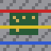

# CircuitSimCraft

A Fabric mod that turns Minecraft into an analog electronics lab. Place resistors, capacitors,
inductors and memristors as blocks, wire them up, drive them with power supplies and function
generators, and probe the live voltage/current with a handheld oscilloscope — all backed by a
real modified-nodal-analysis (MNA) circuit solver, the same family of algorithm SPICE uses, not a
scripted approximation.

This is a teaching tool: the goal is for the in-game behavior to actually match what you'd see on
a real bench (RC charge curves, RL transients, a memristor's resistance drifting with accumulated
charge), just at Minecraft-tick timescales instead of real-world ones.

## Screenshots

The oscilloscope pinning three channels at once — a Function Generator, a Capacitor, and a
Resistor, each with their own color-coded trace and live V/I readout:

| Square wave | Triangle wave |
|---|---|
|  |  |

## Requirements

- **Minecraft 26.2** — note this is Mojang's new `year.release` versioning, *not* the old `1.21.x`
  line. The mod targets this specific version because it's what "latest" means as of build time.
- **Fabric Loader** >= 0.19.3
- **Fabric API** 0.155.2+26.2 (must match the Minecraft version)
- **Java 25** — this is a Minecraft 26.2 requirement in general (it ships unobfuscated and needs a
  current JDK), not something specific to this mod.

## Installation

### Option A — prebuilt jar

1. Install [Fabric Loader](https://fabricmc.net/use/installer/) for Minecraft 26.2.
2. Download the **Fabric API** jar for 26.2 from [Modrinth](https://modrinth.com/mod/fabric-api) or
   [CurseForge](https://www.curseforge.com/minecraft/mc-mods/fabric-api) and drop it in your
   `mods` folder.
3. Grab `circuitsimcraft-<version>.jar` from this repo's [Releases](../../releases) page and drop
   it in the same `mods` folder.
4. Make sure the profile you launch with is on Java 25+ (recent launchers that auto-manage a JVM
   per Minecraft version will already do this once you select 26.2).
5. Launch with the Fabric profile.

### Option B — build from source

```bash
git clone https://github.com/rpicos-uib/circuitsimcraft.git
cd mine-memristors
./gradlew build
```

The mod jar comes out at `build/libs/circuitsimcraft-<version>.jar`. You need a JDK 25 available;
either make it your default `java`, or point Gradle at it explicitly:

```bash
JAVA_HOME=/path/to/jdk-25 ./gradlew build
```

Useful dev tasks: `./gradlew runClient` (launches a dev client with the mod loaded) and
`./gradlew runServer` (headless dedicated server — handy for checking the mod loads without a GUI).

## Basic Components

For any component whose value is a single number rather than a category (resistance,
capacitance, inductance, voltage, frequency, the memristor's parameters), an empty-hand
**shift+right-click** opens a text-entry screen — the same interaction spirit as editing a
sign — pre-filled with the current value(s) and the same min/max range its preset cycle
already covers. A plain empty-hand right-click still cycles through the fixed presets exactly
as before; the two interactions coexist.

These are the **Electrician** villager's stock-in-trade (see below) — the everyday passive
components, sources, and instrumentation you need for a basic circuit. Transistors, controlled
sources, and the diode live in [Advanced Components](#advanced-components) instead, sold by the
**Electronics Engineer**.

| Block/Item | What it is |
|---|---|
|  **Resistor** | Ohmic resistor. Right-click (empty hand) to cycle 10 / 100 / 1,000 / 10,000 Ω; shift+right-click opens the value editor for an exact resistance. |
|  **Capacitor** | Ideal capacitor, trapezoidal-integration model. Cycles 1 / 10 / 100 / 1,000 µF; shift+right-click opens the value editor for an exact capacitance. |
|  **Inductor** | Ideal inductor, trapezoidal-integration model. Cycles 0.01 / 0.1 / 1 / 5 H (scaled for Minecraft's tick rate, not real-world component ratings); shift+right-click opens the value editor for an exact inductance. |
|  **Memristor** | Charge-controlled linear-drift (HP) memristor model. Resistance drifts between $R_{on}$ and $R_{off}$ based on accumulated charge through it — the "memory" persists even when the circuit is rebuilt. Empty-hand right-click cycles a "switching speed" ($q_{max}$) preset as before (defaults: $R_{on}=100\,\Omega$, $R_{off}=10{,}000\,\Omega$); shift+right-click opens the value editor for all three parameters at once — $R_{on}$ (10–1,000 Ω), $R_{off}$ (1,000–100,000 Ω), and $q_{max}$ (1e-4–1e-2 C). |
|  **Power Supply** | Ideal DC voltage source. Cycles 1.5 / 5 / 9 / 12 / 24 V; shift+right-click opens the value editor for an exact voltage. Inactive (open-circuit) until it receives a redstone signal - wire up the circuit first, then power it on. |
|  **Function Generator** | Time-varying voltage source. Cycles sine/square/triangle presets (waveform shape only - see Voltage/Frequency Module below for amplitude and frequency, both of which do support the value editor). Same redstone-activation behavior as the Power Supply. Defaults to 5V/1Hz with no modules attached. |
|  **Wire** | Zero-resistance conductor block. Connects on all six faces. Probeable in its own right (see Probe below) - gives the absolute voltage at that point in the circuit, not just a drop across two leads. |
|  **Ground** | Ties whatever network it's wired into to a real 0V reference point, the same way a real circuit needs a ground reference before "voltage at this node" means anything. Conductive on all six faces, wire it in like any other participant. Probing it always reads exactly 0V, confirming what's actually tied to reference. |
|  **Ammeter** | A 0V voltage source in series - electrically an ideal wire, so it doesn't disturb the circuit, but gives an exact current reading. Pin it with the Probe to see a live current trace on the oscilloscope, the same way you'd watch a voltage. |
|  **Ideal Op-Amp** | Infinite gain, infinite input impedance, zero output impedance - the textbook ideal op-amp, enforcing a "virtual short" between its two inputs via its own dedicated branch-current unknown in the solver (the same MNA trick used for voltage sources, just referencing different nodes for the constraint than for the current injection). The only 3-terminal component: output and the inverting input (V−) are the front/back leads as usual; the non-inverting input (V+) is the block's top face (or its north face, if the block itself is oriented vertically). Fixed, ideal behavior with no adjustable parameter at all, so there's no preset cycle and no value editor; the AC (Bode-plot) solver instead uses a fixed two-pole gain model (100dB DC gain, poles at 20Hz and 3MHz) - see AC Source/AC Probe below. |
|  **AC Source** | The excitation for an AC (small-signal) sweep. Wired like any other two-terminal component, but electrically a 0V source (a plain wire) in the regular DC/transient simulation - its real behavior only appears through the AC Probe. All three parameters (amplitude, min frequency, max frequency) are set through shift+right-click only, since a frequency *range* isn't the kind of thing a short preset list represents well - there's no plain-right-click preset cycle at all for this one. |
|  **Voltage Module** | Undirected utility cube (no facing, no leads) that touches a Function Generator on any face and sets its amplitude. Right-click cycles its own preset (1.5/5/9/12/24 V); shift+right-click opens the value editor for an exact voltage. Same-kind modules touching each other relay one shared value along the whole chain - whichever module was right-clicked most recently wins and propagates to every generator the chain reaches, so one control can drive several generators at once. |
|  **Frequency Module** | Same idea as the Voltage Module, but sets a Function Generator's frequency (0.5/1/2/5/10 Hz presets); shift+right-click opens the value editor for an exact frequency. A mixed chain of Voltage and Frequency modules relays both values through, regardless of which order they're arranged in. |
|  **Probe** | Right-click a component, Wire, or Ground to pin it as one of up to 3 channels shown simultaneously on the oscilloscope HUD (pinning a 4th evicts the oldest); shift+right-click unpins it. Hold the probe in either hand to see the HUD - each pinned channel gets its own scrolling trace, color-coded, stacked in the corner. A component shows the voltage drop across its two leads; a Wire or Ground shows the absolute voltage at that single point. Each channel's trace is auto-scaled to its own history, with the full-scale value printed at the top and bottom of its graph in SI-prefixed form (k/m/u/n/p, whichever keeps the number compact). Once all 3 slots are full, the oldest channel is outlined in yellow and labeled "(next)" so you can see which one a new pin would evict before you commit to it. |
|  **X-Y Oscilloscope Probe** | A second, independent probe: instead of plotting channels against time, it plots one pinned channel's voltage against another's - a real bench oscilloscope's X-Y mode, tracing Lissajous figures for phase/frequency comparisons. Right-click to pin - whichever block you just clicked always becomes (or stays) the **Y** channel, demoting the previous Y to X and evicting the old X if both slots were already full; shift+right-click unpins. Each axis is scaled independently to its own channel's peak magnitude, with the full-scale value printed at both ends of each axis directly on the plot in SI-prefixed form (k/m/u/n/p), so two very differently sized signals both use the plot's full range instead of one being squashed by a shared scale - a 90°-phase-shifted, equal-amplitude pair still traces an actual circle, since the two independent scales coincide whenever the amplitudes actually match. Independent of the regular Probe's own pins - hold both at once to see both HUDs side by side. |
|  **AC Oscilloscope Probe** | A genuine two-step probe, unlike the other two: right-click an AC Source first to pin it as the sweep's excitation (a hint appears; nothing is computed yet). Right-click a second, different point afterward - any component, wire, or ground - to run the sweep (60 log-spaced frequencies across the source's configured range) and show a Bode plot: magnitude in dB on top, phase in degrees below, both against log-frequency. The source stays pinned afterward, so you can probe more points against it without re-clicking it each time; shift+right-click unpins. |
|  **R2V Converter** | Redstone-to-voltage interface: must be placed directly on top of a **Ground** block (both a placement requirement and its 0V electrical reference). Reads two 0-15 redstone signal strengths - North = A, South = B - and outputs V = A×16 + B (0-255V) on its top face, wired into the rest of the circuit like any other source. No value editor; the output is entirely redstone-driven. |
|  **V2R Converter** | The inverse of the R2V Converter: also placed directly on Ground, reads whatever voltage is wired into its top face (an ideal voltmeter - draws no current, never loads down what it's measuring), and decodes it back into two 0-15 redstone outputs on its North (A) and South (B) faces, the exact inverse of V = A×16 + B. |
|  **Breadboard** | Not a circuit component - it has no leads and takes no part in the solver. It's the **Electrician** villager's job site block (see below): place one, let an unemployed villager claim it, and it starts selling the rest of this table. |

### Wiring rules

Every component occupies one block, oriented by the direction you were looking when you placed
it. Its two electrical leads are its front and back faces (along that facing axis) — the other
four faces are insulated. Wire blocks conduct on all six faces. Two positions merge into the same
electrical node whenever each one presents a conductive face toward the other — so components
"connect" either through wire, or by placing two components lead-to-lead directly against each
other, no wire needed in between.

An unconnected lead doesn't crash anything — it's treated as a floating node, so you can build a
circuit incrementally and it'll simulate (uselessly, but safely) at every intermediate stage.

The R2V/V2R Converters and the four controlled sources (VCVS/VCCS/CCCS/CCVS, see
[Advanced Components](#advanced-components)) are the exception to "leads follow the direction
you were looking when placed": their orientation is always fixed (up = the wired electrical
lead(s), down = the required Ground connection, north/south = redstone I/O or control leads),
regardless of which way you were facing when you placed them. They also physically require a
**Ground** block directly beneath them to place at all — break that Ground and the converter
or controlled source breaks with it.

The transistors (NPN/PNP/NMOS/PMOS) and the Ideal Op-Amp are **3-terminal** components: front
and back are two of the three leads as usual, and the third (base/gate, or the op-amp's V+) is
the block's top face — or its north face, if the block itself is oriented vertically (facing
up or down).

## Advanced Components

Transistors, the four classic dependent/controlled sources, and a couple of instrumentation
pieces that round out a real bench — sold by the **Electronics Engineer** villager (see below),
not the Electrician. All the "simplest model" parameters below (β, threshold voltage,
transconductance, gain) are editable via shift+right-click, the same value-editor convention as
the basic components.

Every dependent source here relies on a deliberate one-tick lag: `Circuit.step()` stamps every
element *before* solving, so any element that reads another node's already-solved voltage (or
another source's already-solved current) while building its own stamp is necessarily reading the
*previous* tick's converged value — the same "linearize about last tick" philosophy the Diode
already used. This is what lets all four controlled sources, the BJTs, and the MOSFETs work
without any change to `Circuit`'s core solve loop (aside from one new stamping helper,
`stampTransconductance` — see [`MOD_ARCHITECTURE.md`](MOD_ARCHITECTURE.md) for the full writeup).

| Block/Item | What it is |
|---|---|
|  **Diode** | The lead facing the direction you were looking when you placed it is the anode, the opposite lead is the cathode - current flows readily anode→cathode past the forward voltage, and is (almost) blocked in reverse. Right-click cycles silicon (~0.7V) / germanium (~0.3V) / red LED (~2V) presets - a categorical choice, so there's no shift+right-click value editor for the diode. Modeled with a linearized Shockley diode equation re-fit every tick, not a lookup table. |
|  **Current Source** | Ideal independent DC current source - the dual of the Power Supply. Cycles 0.1 / 0.5 / 1 / 2 A; shift+right-click opens the value editor for an exact current. Same redstone-activation behavior as the Power Supply (inactive = open circuit until powered). |
|  **Voltmeter** | An ideal voltmeter in series - infinite input impedance, draws no current, never loads down the circuit it's reading. The voltage dual of the Ammeter: pin it with the Probe to see a live voltage trace, same as any other component. |
|  **NPN Transistor** | Collector is the front (facing) lead, emitter the back, base the top face (or north, if placed vertically). Base-emitter junction reuses the Diode's own linearized Shockley model; collector current is β × base current, stamped as an exact transconductance term (no lag) via `stampTransconductance`. Shift+right-click edits β (current gain), 5–500. |
|  **PNP Transistor** | Same model and leads as the NPN, with every current direction reversed (`polarity = -1` in the underlying `Bjt` model). Shift+right-click edits β, 5–500. |
|  **NMOS Transistor** | Drain is the front lead, source the back, gate the top face (or north, if placed vertically). Square-law, saturation-only model, linearized each tick around the previous drain current. Shift+right-click edits threshold voltage (0.1–5 V) and transconductance *k* (1e-4–0.1 S). |
|  **PMOS Transistor** | Same model and leads as the NMOS, with drain current direction reversed. Shift+right-click edits the same two parameters. |
|  **VCVS** (voltage-controlled voltage source) | Must be placed directly on a **Ground** block, like the R2V/V2R Converters. North face senses a control voltage (against Ground); the output (gain × control voltage) is driven onto the top face. Shift+right-click edits the gain, 0.1–100. |
|  **VCCS** (voltage-controlled current source) | Same shape as the VCVS, but drives a current (transconductance × control voltage) out its top face instead of a voltage - stamped as an exact transconductance term, no lag, since it's a purely linear relation. Shift+right-click edits the transconductance, 1e-4–1 S. |
|  **CCCS** (current-controlled current source) | A 4-face component: north/south are the control-current sense leads (an internal 0V ammeter, like the Ammeter block), top drives the output current (current gain × sensed current) against the required Ground below. Shift+right-click edits the current gain, 0.1–100. |
|  **CCVS** (current-controlled voltage source) | Same 4-face shape as the CCCS, driving a voltage (transresistance × sensed current) instead of a current. Shift+right-click edits the transresistance, 1–1,000 Ω. |
|  **Workbench** | Not a circuit component - it has no leads and takes no part in the solver. It's the **Electronics Engineer** villager's job site block (see below): place one, let an unemployed villager claim it, and it starts selling the rest of this table. |

## Three-Phase Components

A whole second electrical "world" living alongside the mono one above — every component here has
a **single bundled lead** carrying all three phases (A/B/C) at once, rather than three separate
physical connections. A dedicated bundle wire lets you route that bundle anywhere (it merges with
any touching bundle wire or bundled lead, exactly like the mono Wire does for a single node), and
a Bundler/Unbundler pair crosses between the two worlds when you need to. Sold by the **Electrical
Engineer** villager (see below), not the Electrician or Electronics Engineer.

| Block/Item | What it is |
|---|---|
|  **3-Phase Wire** | The bundle equivalent of Wire — paints freely in any direction, merges with any touching 3-phase wire or bundled lead. Carries phase A/B/C together as one connection; a plain mono Wire touching it simply doesn't connect (you need a Bundler/Unbundler to cross between the two worlds) — **except Ground**, which closes either world directly (see below). |
|  **3-Phase Source** | The facing direction is the bundled 3-phase output (three internal sinusoidal sources at the same frequency/amplitude, 120° apart — standard A/B/C phase rotation); the opposite face is an ordinary single neutral lead, wired to a Ground block the same way every other source's "back" lead works. Shift+right-click edits amplitude (12–400 V) and frequency (0.5–5 Hz). Redstone-gated like the Power Supply. |
|  **3-Phase Ammeter** | Three independent ideal ammeters in series, one per phase — both leads bundled, in-line like the mono Ammeter. |
|  **3-Phase Resistor** | Three ordinary resistors in parallel, one per phase, sharing one editable resistance (10–10,000 Ω) — a balanced resistive load/bank. |
|  **3-Phase Inductor** | Same idea, three inductors sharing one editable inductance (0.01–5 H). |
|  **3-Phase Capacitor** | Same idea, three capacitors sharing one editable capacitance (1–1,000 µF). |
|  **Phase Bundler** | Fixed, non-rotatable faces: the bundled lead is always Up, phase A/B/C are always North/East/South. Purely topological — no impedance added, exactly like a plain wire itself — takes three separate mono connections and aliases them directly onto the matching bundle sub-node. |
|  **Phase Unbundler** | Electrically identical to the Bundler (same fixed faces, same zero-impedance aliasing) — a separate block purely so "bundle → three wires" and "three wires → bundle" read as distinct pieces when you're wiring a bench. |
|  **3-Phase Oscilloscope Probe** | Right-click a bundled component to pin it (shift+right-click unpins) — up to 3 channels at once, same as the regular Probe, except each channel now overlays all three phases on one graph in the standard red/yellow/blue phase-color convention, instead of one trace per channel. |
|  **Switchboard** | Not a circuit component — the **Electrical Engineer** villager's job site block (see below). |

Every 3-phase part is built from **three of its mono equivalent** — `3× Wire → 1× 3-Phase Wire`,
`3× Power Supply → 1× 3-Phase Source`, `3× Ammeter → 1× 3-Phase Ammeter`, `3× Resistor/Inductor/
Capacitor → 1×` the matching 3-phase part, `3× Probe → 1× 3-Phase Probe` — all shapeless. The
Bundler/Unbundler are each `3× Wire + 1 iron ingot`, also shapeless. (Dedicated recipe-diagram
images for this table, matching the style above, are a follow-up — not generated yet.)

**Ground works in both worlds** — a `circuitsimcraft:ground` block is bundle-conductive as well as
its usual mono conductivity, so a 3-Phase Wire run can end directly at a Ground with no Bundler/
Unbundler needed, exactly like a mono Wire run already could. You only need an Unbundler when you
actually want the three phases split out to separate mono destinations (three individual gauges,
three individual loads, etc.) — not just to close a loop back to 0V.

## Crafting recipes

All vanilla ingredients, no dependency on any other mod. Shapeless recipes are shown as a loose set
of ingredients; shaped ones show the actual 3×3 grid layout. Where a recipe accepts either of two
materials in the same slot, both variants are shown stacked as two complete recipes leading to the
same result, rather than merged into one image.

| Recipe | Notes |
|---|---|
|  | **Resistor ×2** — iron nugget, clay ball **or coal** as the resistive body, iron nugget: leads on both sides of the body, shaped. |
|  | **Capacitor ×2** — iron nugget, paper as the historical capacitor dielectric, iron nugget: leads on both sides, shaped. |
|  | **Inductor ×2** — iron nugget, copper **or iron** ingot for the coil, iron nugget: leads on both sides, shaped. |
|  | **Memristor ×1** — amethyst shard for the switching medium. |
|  | **Power Supply ×1** — 3×3 iron/copper shell around a redstone block core. |
|  | **Function Generator ×1** — 3×3 iron/copper shell, quartz + redstone torch core. |
|  | **Wire ×9** — three copper ingots in a row, shaped, cheap/bulk. |
|  | **Ground ×4** — iron nugget + copper ingot. |
|  | **Ammeter ×2** — iron nugget, copper ingot, redstone. |
|  | **Voltage Module ×1** — gold nugget, redstone, iron nugget. |
|  | **Frequency Module ×1** — amethyst shard, redstone, iron nugget. |
|  | **Diode ×2** — iron nugget, redstone, quartz. |
|  | **Ideal Op-Amp ×1** — 2 gold nuggets, redstone, quartz. |
|  | **Probe ×1** — redstone, iron nugget, and a stick, stacked vertically. |
|  | **X-Y Oscilloscope Probe ×1** — redstone, quartz, and a stick, stacked vertically. |
|  | **AC Source ×1** — redstone, glowstone dust, gold nugget (shapeless). |
|  | **AC Oscilloscope Probe ×1** — redstone, glowstone dust, and a stick, stacked vertically. |
|  | **R2V Converter ×1** — 3×3 iron/copper shell around a Comparator core, the vanilla device for reading redstone strength. |
|  | **V2R Converter ×1** — 3×3 iron/gold shell around a Comparator core. |
|  | **Breadboard ×1** — 3×3, oak planks frame around a redstone-and-iron-nugget core. |
|  | **Current Source ×1** — 3×3 gold/copper shell around a redstone block core (the Power Supply's dual). |
|  | **Voltmeter ×2** — iron nugget, gold nugget, redstone. |
|  | **NPN Transistor ×2** — 2 iron nuggets, quartz, redstone. |
|  | **PNP Transistor ×2** — 2 iron nuggets, glowstone dust, redstone. |
|  | **NMOS Transistor ×2** — 2 iron nuggets, paper (gate insulation), quartz. |
|  | **PMOS Transistor ×2** — 2 iron nuggets, paper, glowstone dust. |
|  | **VCVS ×1** — 3×3 copper/gold shell around a Comparator core. |
|  | **VCCS ×1** — 3×3 copper/iron shell around a Comparator core. |
|  | **CCCS ×1** — 3×3 gold/copper shell around a Comparator core. |
|  | **CCVS ×1** — 3×3 gold/iron shell around a Comparator core. |
|  | **Workbench ×1** — 3×3, smooth stone frame around a redstone-and-iron-nugget core (the Breadboard's own job-site pattern, restyled in stone). |

None of these have recipe-book unlock advancements yet, so they won't show a "new recipe" toast —
but they're fully craftable by hand right now. See [Contributing](#contributing) if you want to add
those.

All items are also available in their own **CircuitSimCraft** creative-inventory tab.

## The Electrician villager

Place a **Breadboard** (crafted as shown above) and let an unemployed villager claim it as a job
site; it becomes an **Electrician** and both **sells** the mod's own components and **buys back**
the raw materials needed to craft them, all for emeralds, instead of vanilla trades. It has its
own look, not the default missing-texture placeholder: a slate/steel tool apron with
warning-yellow badge accents, distinct from any vanilla profession's outfit. Like every vanilla
profession, it levels up (Novice → Master) as it successfully trades, unlocking later tiers. Each
level offers **at most two components to sell and at most two raw materials to buy** (never more,
always both), so no single villager is ever a wall of trades - **except Master**, which is a
deliberate exception (see below):

| Level | Sells | Buys |
|---|---|---|
| 1 — Novice | Resistor, Capacitor | Iron Nugget, Clay Ball |
| 2 — Apprentice | Power Supply, Function Generator | Iron Ingot, Copper Ingot |
| 3 — Journeyman | AC Source | Gold Nugget, Glowstone Dust |
| 4 — Expert | Probe, AC Oscilloscope Probe | Redstone, Stick |
| 5 — Master | any 2 of Memristor / R2V Converter / V2R Converter | Amethyst Shard, Redstone (usually both) |

Buy trades collect **8** of the raw material per trade (**4** for Amethyst Shard, the rarest
one - a batch you can actually gather without grinding); sell trades keep each component's
original per-trade quantity (1-2 at a time, unchanged from before). Every trade - buy and sell
alike - can now be used **15** times before that villager needs to restock via more trading
(`max_uses: 15`, a flat number replacing the previous per-tier values of 4-12). Buy prices are
cheaper than sell prices for the same tier, same as a real shop margin: raw materials are worth
less than the finished component they go into.

Not every craftable item is sellable this way anymore - Wire, Ground, Inductor, Voltage Module,
Frequency Module, and the X-Y Oscilloscope Probe were trimmed out to keep to the two-per-level
cap (all six are still simple, cheap crafting-table recipes, unaffected). The Diode isn't trimmed,
just relocated - it's sold by the **Electronics Engineer** instead (see below), not the
Electrician. Trades are entirely
data-driven (`data/circuitsimcraft/{villager_trade,tags/villager_trade,trade_set}/electrician/`)
rather than hardcoded in Java - this Minecraft version's `VillagerProfession` only points at
`TradeSet` resource keys per level, so rebalancing prices or adding trades is a JSON edit, no
rebuild required. Each level's `trade_set` `amount` is set equal to its trade pool's size, so
every listed trade is always offered together rather than a random subset (unlike vanilla
professions, which usually roll a handful from a larger pool) - the only way to guarantee the
"both sell items and both buy items are always present" promise above.

**Master is the one deliberate exception.** At the user's request, Master's sell pool has three
items (Memristor, R2V Converter, V2R Converter) instead of two, and any given Electrician
randomly offers only two of the three - real vanilla-style randomness, reintroduced on purpose
for this one tier. Minecraft's trade-set system can only randomize across *one* combined
pool per level, with no way to keep a subset (the two buy trades) deterministic while
randomizing another subset (the three sell trades) within that same level - so Master's full
pool is 5 entries (3 sell + 2 buy) with `amount: 4`, meaning exactly one entry gets excluded at
random. Most of the time that's one of the three sell items (giving the intended "any two of
three"), but occasionally it's one of the two buy items instead - Master is the only tier where
the "both buy items always present" guarantee isn't absolute.

### Electrician's Workshop

The mod ships a ready-made shop as a datapack function - no manual building required. Stand
where you want it (any terrain: it clears its own footprint and pours its own foundation first,
so uneven ground, slopes, or ungenerated chunks are all fine) and run:

```
/function circuitsimcraft:electrician_shop
```

This builds a small oak-and-copper workshop with a slab roof, a lightning rod finial (the most
literal "electrician" symbol available), and a Breadboard already placed inside against the back
wall next to a small shelf of stock (wire, a resistor, a capacitor) - ready for a villager to
walk in and take the job:


The function's source (`data/circuitsimcraft/function/electrician_shop.mcfunction`) is plain
`/fill`/`/setblock` commands if you want to reskin it - see
[`MOD_ARCHITECTURE.md`](MOD_ARCHITECTURE.md) for how it was built and verified.

## The Electronics Engineer villager

Place a **Workbench** (crafted as shown above) and let an unemployed villager claim it as a job
site; it becomes an **Electronics Engineer** and sells/buys the [Advanced Components](#advanced-components)
table above, the same way the Electrician handles the basic one. It has its own distinct look
too — a white lab-coat recolor of the Electrician's own texture, with the badge accents shifted
from warning-yellow to a diode-red glow, so the two professions are never visually confused.
Same leveling (Novice → Master), same "at most two sells and buys per level, never more" rule,
with Master again the deliberate exception:

| Level | Sells | Buys |
|---|---|---|
| 1 — Novice | Diode, Voltmeter | Quartz, Paper |
| 2 — Apprentice | Current Source, NPN Transistor | Iron Nugget |
| 3 — Journeyman | PNP Transistor, NMOS Transistor | Glowstone Dust |
| 4 — Expert | PMOS Transistor, VCVS | Gold Ingot |
| 5 — Master | any 2 of VCCS / CCCS / CCVS | Redstone Block (usually present) |

Same trading terms as the Electrician throughout: buy trades collect **8** of the raw material
per trade (**4** redstone blocks at Master, the priciest one), every trade allows **15** uses
before restocking, and sell prices scale up with tier (2 emeralds at Novice up to 8 at Master,
matching the Electrician's own R2V/V2R-tier pricing for the dependent sources). Master's sell
pool has three items with only two ever offered at once — the same reused "random exclusion"
trick as the Electrician's own Master tier, except here the full pool is 4 entries (3 sell + 1
buy) with `amount: 3`, so occasionally the excluded entry is the buy trade instead of a sell
item, not just "any two of three" sells.

### Electronics Engineer's Workshop

Same idea as the Electrician's Workshop, deliberately built in a different palette so the two
professions' buildings read as distinct at a glance — a stone-brick-and-polished-andesite "lab"
with iron bars and a quartz finial, instead of the Electrician's oak-and-copper cabin:

```
/function circuitsimcraft:engineer_workshop
```

This places a Workbench against the back wall with a small stock shelf (a Diode and an NPN
Transistor) next to it, exactly like the Electrician's own shop places a Breadboard and starter
stock. The function's source is
`data/circuitsimcraft/function/engineer_workshop.mcfunction` — plain `/fill`/`/setblock` commands,
same as the Electrician's.

## The Electrical Engineer villager

Place a **Switchboard** (crafted the same way as the Workbench and Breadboard — see
[Crafting recipes](#crafting-recipes)) and let an unemployed villager claim it as a job site; it
becomes an **Electrical Engineer** and sells/buys the [Three-Phase Components](#three-phase-components)
table above — a third profession, alongside the Electrician (basic mono components) and the
Electronics Engineer (advanced mono components), this time for the bundled 3-phase world. Same
leveling (Novice → Master), same pricing/restock conventions as the other two:

| Level | Sells | Buys |
|---|---|---|
| 1 — Novice | 3-Phase Wire, 3-Phase Ammeter | Copper Ingot ×8 |
| 2 — Apprentice | 3-Phase Source, 3-Phase Probe | Iron Nugget ×12 |
| 3 — Journeyman | Phase Bundler, Phase Unbundler | Glowstone Dust ×4 |
| 4 — Expert | 3-Phase Resistor, 3-Phase Inductor | Gold Ingot ×4 |
| 5 — Master | 3-Phase Capacitor | Redstone Block ×1 |

Same trading terms as the other two villagers: every trade allows **15** uses before restocking,
and sell prices scale up with tier — 2 emeralds each at Novice, up to 8–9 emeralds at Expert/
Master for the priciest bundle-graph parts (Bundler/Unbundler at 8, Inductor/Capacitor at 9).

### Electrical Engineer's Workshop

Same idea as the other two workshops, in its own distinct palette so all three professions'
buildings read apart at a glance — a deepslate-brick-and-copper "substation" with a lightning
rod finial, instead of the Electrician's oak cabin or the Electronics Engineer's stone lab:

```
/function circuitsimcraft:electrical_engineer_workshop
```

This places a Switchboard against the back wall, ready for a villager to walk in and take the
job. The function's source is
`data/circuitsimcraft/function/electrical_engineer_workshop.mcfunction` — plain
`/fill`/`/setblock` commands, same as the other two.

## Worked-example circuits

Seven ready-made circuits, one datapack function each, the same `/fill`/`/setblock`-based
approach as the three workshops above — no manual wiring required to get started. Stand where
you want the bench's southwest corner and run one:

```
/function circuitsimcraft:voltage_divider        # Experiment 1: basic voltage divider
/function circuitsimcraft:rc_lowpass             # Experiment 2: RC low-pass Bode plot
/function circuitsimcraft:rlc_resonance          # Experiment 3: RLC resonance Bode plot
/function circuitsimcraft:half_wave_rectifier    # Experiment 4: half-wave rectifier
/function circuitsimcraft:memristor_hysteresis   # Experiment 5: memristor pinched hysteresis loop
/function circuitsimcraft:opamp_bode             # Experiment 6: op-amp open-loop Bode plot
/function circuitsimcraft:three_phase_load       # Experiment 7: balanced three-phase resistive load
```

Each clears its own space, pours its own foundation, wires up the circuit at every
component's *default* preset (no component in this mod persists a right-click-selected preset
across a save/reload, so a freshly-placed one always starts at its default regardless of what
an experiment calls for), places an unflipped lever on top of the source, and gives you the
right oscilloscope probe for the job. The function's own header comment states the exact
right-clicks needed to reach each experiment's intended component values and the expected
result. The first six are described in full (derivations, predicted numbers, and the physics
behind each) in the mod's companion paper, `latex_mod/sections/07_results_experiments.tex`,
reproduced here as buildable structures rather than left as a diagram — Experiment 7 (the
three-phase bench) postdates that writeup and isn't in the paper yet. Their sources live in
`data/circuitsimcraft/function/`, plain text like
every other function in the mod.

## Architecture, for anyone extending this

```
src/main/java/com/rpicos/circuitsimcraft/
  sim/            Pure-Java circuit solver — zero Minecraft dependency, unit-testable standalone
  block/          Block classes (placement, orientation, right-click interactions)
  blockentity/    BlockEntity classes (the actual sim state + circuit wiring per component)
  network/        World-side wire connectivity graph + the client<->server probe protocol
  item/           The probe item
src/client/java/com/rpicos/circuitsimcraft/client/   HUD rendering, client-side networking
```

### The solver (`sim` package)

`Circuit` is a general modified-nodal-analysis engine: node 0 is always ground, every other node
is an integer you allocate with `addNode()`. `Element` implementations (`Resistor`, `Capacitor`,
`Inductor`, `Memristor`, `CurrentSource`, `Vccs`, `Bjt`, `Mosfet`) stamp themselves into the
conductance matrix each step; `VoltageSource` gets its own branch-current unknown, the standard
MNA treatment for ideal sources — `Vcvs` and `Ccvs` are both thin factories that just build one.
Reactive elements use trapezoidal-integration companion models (the same technique SPICE uses)
rather than backward Euler, so LC-type behavior doesn't get artificially damped out; the BJT and
MOSFET models reuse that same "linearize about last tick" spirit (the BJT's base-emitter junction
literally reuses the Diode's own `DiodeMath` helper). Every dependent/active element's defining
asymmetry versus a passive, reciprocal resistor is captured in one shared stamping helper,
`stampTransconductance` — see [Advanced Components](#advanced-components) above for the one-tick-lag
reasoning that lets all four controlled sources and both transistor families work without touching
this solve loop at all.

A second, complex-valued solver, `AcCircuit`, sits alongside it for AC (Bode-plot) analysis:
`Complex` is a plain immutable complex number, `AcElement` implementations stamp a frequency-dependent
admittance given an angular frequency directly (no timestep involved), and `AcVoltageSource`/`AcOpAmp`
handle sources and the op-amp's two-pole gain model the same "own branch-current unknown" way their
transient counterparts do. `CircuitNetworkManager` computes the wiring topology once and reuses the
identical node numbering for both solvers, so they can never disagree on which position is which node.

Because this package has no Minecraft imports at all, you can write and run plain-Java tests
against it directly with `javac`/`java` — no Gradle, no decompiling Minecraft, fast iteration.
That's how the solver was validated during development: against closed-form RC/RL step responses,
the memristor's analytic charge-controlled ODE, and — for the AC solver — closed-form Bode-plot
references (a resistive divider's flat response, an RC/RL divider's -3dB/45° cutoff point and
20dB/decade rolloff, and the op-amp model's DC gain and pole frequency).

### Adding a new component type

1. Add the physics to `sim/` if it's a new kind of element (skip this if it's just a different
   preset of an existing one).
2. Create a `blockentity/YourComponentBlockEntity.java` extending `ComponentBlockEntity`,
   implementing `addToCircuit`, `probeCurrent`, `probeSummary`, and `cyclePreset`.
3. Create a `block/YourComponentBlock.java` extending `ComponentBlock` (copy an existing one, e.g.
   `ResistorBlock.java` — it's a ~25-line template).
4. Register it in `ModBlocks`, `ModBlockEntities`, `ModItems`, and add it to `ModCreativeTab`.
5. Add a texture (`textures/block/your_component.png`, 16×16 — front/back automatically get the
   shared `terminal.png` lead texture, so you only need the body texture for the other four
   faces), a `blockstates/your_component.json` and `models/block/your_component.json` (copy an
   existing pair — they're generic besides the texture path), and a lang entry.
6. Optionally add a `data/circuitsimcraft/recipe/your_component.json`.

If your component has 3+ terminals, extend `NetworkBlockEntity` directly instead of
`ComponentBlockEntity` (see `OpAmpBlockEntity`, `NpnBlockEntity`, or the `Vcvs`/`Vccs`/`Cccs`/`Ccvs`
family for precedent) and add your own dispatch branch in `CircuitNetworkManager.rebuild()`. If it
should always sit on a Ground block with a fixed orientation (like the R2V/V2R converters and the
four controlled sources), extend `GroundedComponentBlock` rather than `ComponentBlock` directly.
See [`COMPONENT_ADD.md`](COMPONENT_ADD.md) and [`MOD_ARCHITECTURE.md`](MOD_ARCHITECTURE.md) for
the full walkthrough, including the second-villager-profession pattern if your component should be
sold by a new profession rather than an existing one.

### Known limitations (v0.8)

- **Component state resets on circuit rebuild.** `CircuitNetworkManager` rebuilds the whole
  `Circuit` from scratch whenever wiring changes anywhere in that network, so a capacitor's charge
  or an inductor's current resets to zero at that point. The memristor is the exception — its
  state fraction is explicitly carried across rebuilds, since persistent state is the entire point
  of a memristor. Making the others persist too is a good first contribution.
- **No recipe-book unlock advancements** — recipes work but won't appear highlighted/toast when
  first available.
- **AC analysis is small-signal only, and doesn't cover the Advanced Components at all yet.** Every
  independent source other than the pinned AC Source is always stamped at 0V during a sweep,
  regardless of its own redstone-activated state; the op-amp's two-pole gain (100dB DC gain, poles
  at 20Hz/3MHz) is a fixed constant, not yet exposed through the value editor; and the memristor's
  AC case is simply a frozen resistor with no frequency dependence of its own modeled yet. The
  transistors and the four controlled sources simply have no `AcStampable` implementation at all,
  so they behave as an open circuit during a Bode-plot sweep by omission rather than by any
  deliberate small-signal model — a real next contribution, not a design choice.
- **The base/gate badge texture on a vertically-placed transistor is unverified.** The Java
  electrical model is orientation-correct regardless (base/gate is always the block's north face
  when placed facing up/down, per the wiring rules above) — what's untested is only whether the
  *texture* painted on that literal north face reads correctly to the player when the block itself
  is lying on its side. Confirmed correct for all four horizontal orientations; not yet visually
  checked for facing up/down.

## Contributing

Issues and PRs welcome. If you're adding a component, please include a note on the physical model
you used (a link to the equations is enough) — the goal of this mod is that in-game behavior is
actually correct, not just plausible-looking.

## Citation

If you use CircuitSimCraft — in a classroom, a paper, a demo, a derivative mod, anywhere — please
credit the authors: Rodrigo Picos, Stavros G. Stavrinides, George Stavrinides, Ariadna Picos,
and Gerard Picos. A link back to this repository is enough for informal use; for academic
work, please cite it as:

```
Rodrigo Picos, Stavros G. Stavrinides, George Stavrinides, Ariadna Picos, and Gerard Picos.
CircuitSimCraft: a Fabric mod for teaching analog electronics in Minecraft.
https://github.com/rpicos-uib/circuitsimcraft, 2026.
```

BibTeX:

```bibtex
@software{picos_mine_memristors,
  author = {Picos, Rodrigo and Stavrinides, Stavros G. and Stavrinides, George and Picos, Ariadna and Picos, Gerard},
  title  = {CircuitSimCraft: a Fabric mod for teaching analog electronics in Minecraft},
  url    = {https://github.com/rpicos-uib/circuitsimcraft},
  year   = {2026}
}
```

See also [`CITATION.cff`](CITATION.cff), which GitHub reads automatically for its "Cite this
repository" button.

## License

[CC BY 4.0](https://creativecommons.org/licenses/by/4.0/) — see [LICENSE](LICENSE). Unlike a
permissive software license (MIT, Apache, etc.), CC BY requires attribution as a legal
condition of reuse, not just a courtesy — the citation above is exactly what satisfies that
requirement for academic use; a link back to this repository is enough for informal use.
